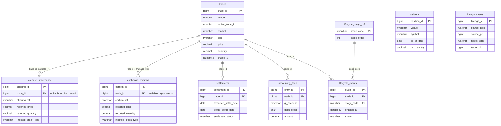

# sql/ — SQL Server Schema Design (Step 2)

## Status

Validated against a live SQL Server 2022 instance (Docker,
`mcr.microsoft.com/mssql/server:2022-latest`, database `reconengine`).
Schema, procs, and views all load and run cleanly; all 11,008 real trades
plus 10,891 synthetic clearing statements and 10,911 synthetic exchange
confirms are loaded and queryable end-to-end
(`sql/load_data.sql`). `vw_TradeReconciliationStatus` over the live data:
92% of trades match cleanly at each stage, the rest split across
`broken`/`missing` — consistent with the ~88%/12% clean/broken design in
`data/synthetic/README.md` once orphan rows are accounted for.

This container is dev/throwaway, not a persistent deployment target —
Step 19 covers standing up a durable instance.

**Image choice**: `mcr.microsoft.com/mssql/server:2022-latest`, run under
x86 emulation on this Apple Silicon host (works, just slower to start).
`mcr.microsoft.com/azure-sql-edge:latest` (native ARM64) was tried as a
faster alternative and crashes immediately and reproducibly on startup in
this environment ("This program has encountered a fatal error and cannot
continue running", confirmed on two separate attempts) — consistent with
Microsoft having retired Azure SQL Edge in 2025. Not worth retrying.

To reproduce:

```bash
docker run -e "ACCEPT_EULA=Y" -e "MSSQL_SA_PASSWORD=<your-password>" \
  -p 1433:1433 --name reconengine-sql -d mcr.microsoft.com/mssql/server:2022-latest

docker cp sql/schema.sql reconengine-sql:/tmp/schema.sql
docker cp sql/procs.sql reconengine-sql:/tmp/procs.sql
docker cp sql/views.sql reconengine-sql:/tmp/views.sql
docker exec reconengine-sql /opt/mssql-tools18/bin/sqlcmd -S localhost -U sa -P '<your-password>' -C -Q "CREATE DATABASE reconengine;"
docker exec reconengine-sql /opt/mssql-tools18/bin/sqlcmd -S localhost -U sa -P '<your-password>' -C -d reconengine -i /tmp/schema.sql
docker exec reconengine-sql /opt/mssql-tools18/bin/sqlcmd -S localhost -U sa -P '<your-password>' -C -d reconengine -i /tmp/procs.sql
docker exec reconengine-sql /opt/mssql-tools18/bin/sqlcmd -S localhost -U sa -P '<your-password>' -C -d reconengine -i /tmp/views.sql

# then load real + synthetic data (see sql/load_data.sql header for the
# 3 required CSV copies into the container's /tmp/ first)
docker exec reconengine-sql /opt/mssql-tools18/bin/sqlcmd -S localhost -U sa -P '<your-password>' -C -d reconengine -i /tmp/load_data.sql
```

Two bugs found and fixed only by actually running this against a live
instance (both disclosed here since they'd otherwise be invisible in the
DDL alone): `BULK INSERT`'s `ROWTERMINATOR` had to be `0x0d0a`, not
`0x0a` — Python's `csv` module writes `\r\n` by default, which silently
corrupted whichever column landed last in each row; and `DATETIME2` casts
on the real trades' `traded_at` needed to go through
`CONVERT(DATETIMEOFFSET, ..., 127)` first to handle the mixed `Z`/`+00:00`
timestamp suffixes across venues.

## Files

- `schema.sql` — DDL for all 13 tables, keys, constraints, indexes
  (includes `ingestion_audit` from Step 4, `reconciliation_results` from
  Step 5, `root_cause_labels` from Step 6, `invoice_reconciliation` from
  Step 9).
- `procs.sql` — stored procedures for common reconciliation lookups
  (unmatched records, field mismatches, position recompute).
- `views.sql` — views the Qlik data model (Step 15) will load from.
- `load_data.sql` / `load_lifecycle.sql` — Step 2/3's one-shot bulk loads
  (permanent staging tables, no validation/audit) — still used to
  reload derived lifecycle/settlement/accounting data after a Step 4 demo.
- `ingest_trades.sql` / `ingest_clearing.sql` / `ingest_confirms.sql` —
  Step 4's per-source loads (session-scoped temp tables, idempotent
  anti-join inserts), driven by `ingestion/run_pipeline.py` — see
  `ingestion/README.md` for the validation + audit trail wrapped around
  these.
- `ingest_reconciliation.sql` — loads Step 5's matching engine output
  (`reconciliation/matching_engine.py`) into `reconciliation_results`.
- `ingest_root_cause.sql` — loads Step 6's taxonomy crosswalk
  (`root_cause/taxonomy.py`) into `root_cause_labels`.
- `ingest_invoice.sql` — loads Step 9's invoice reconciliation
  (`invoice_recon/generate_invoice.py`) into `invoice_reconciliation`.

## ER diagram



`positions` and `lineage_events` aren't drawn with FK arrows above: both
key off `(venue, symbol)`/arbitrary source-target table pairs rather than
a single `trade_id`, by design — `positions` is an aggregate over many
trades, and `lineage_events` deliberately stays table-agnostic so Step 12
can point it at any table pair without a schema change.

## Design decisions (disclosed)

- **`trade_id` is nullable on `clearing_statements`/`exchange_confirms`.**
  Both "a real trade with no clearing/confirm record at all" (missing
  break) and "a clearing/confirm record with no matching real trade"
  (orphan break — the clearing firm or exchange reports something the
  front office never captured) are real, common break patterns. Making
  the FK nullable represents both without a sentinel row.
- **`injected_break_type` lives directly on the synthetic tables**, not
  only in a side file. Every synthetic row honestly labels what, if
  anything, was perturbed about it and why — see
  `data/synthetic/README.md` for the full disclosure and injection rates.
  A real clearing firm's statement obviously wouldn't carry this column;
  it exists here purely so the synthetic layer is auditable at a glance,
  consistent with this project's disclosure-first design.
- **`DECIMAL(18,8)`** for price/quantity, not `FLOAT` or `MONEY` — crypto
  quantities in `data/real/trades_real.csv` go to 8 decimal places (e.g.
  `0.00000001` BTC); `MONEY`'s 4-decimal precision would silently truncate
  real trade data.
- **Natural key `(venue, native_trade_id)`** on `trades`, not the venue's
  native id alone — the three venues' id spaces aren't guaranteed disjoint
  (e.g. Kraken and Coinbase could each mint an id `"12345"`).
- **No `is_synthetic` column on `trades`** — everything in that table is
  real by construction; the flag only exists on the two synthetic tables,
  where its absence would be the anomaly.
